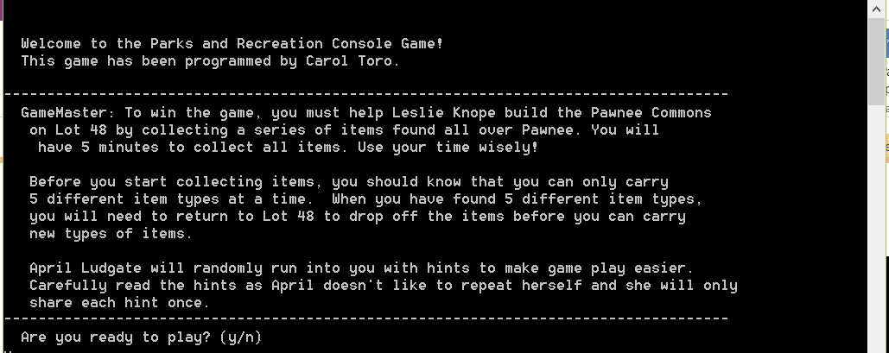
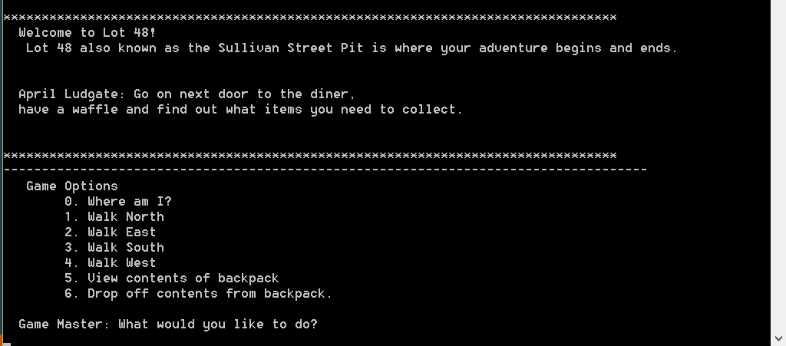
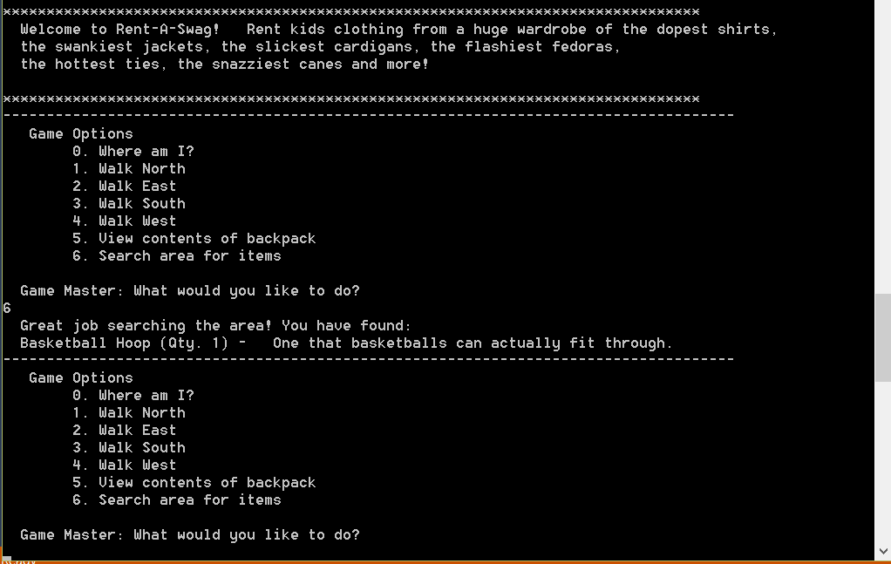
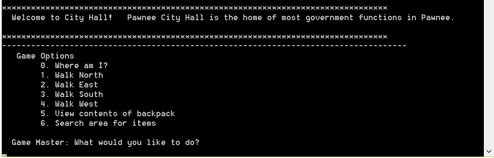
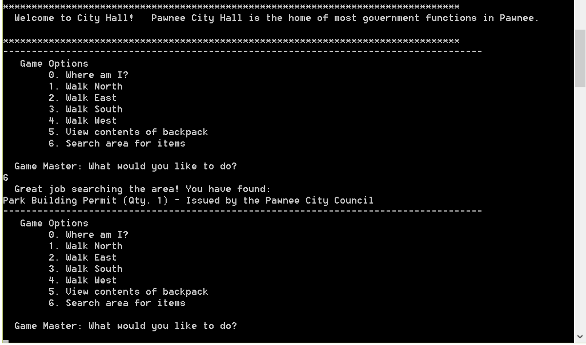
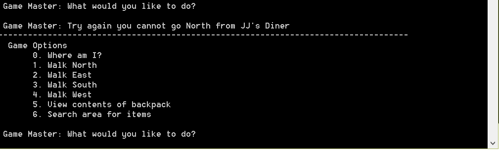

#Console-Game: Parks & Recreation Adventure Game

##About
This repository contains a final project consisting of a text-based adventure game based off the popular sitcom "Parks and Recreation". The console game was coded in C++ to apply coursework in class inheritance, polymorphism, and dynamic memory allocation. 

Originally this program used a simple threaded timer to limit game play to no more than 5 minutes. Due to changes in the libraries used which are no longer compatible with the original code, the timer has been removed.

By no means should this repository be used by other students to copy assignment work.


##Installation & Configuration

##Installation
Clone the directory

###How to build
The build process is controlled by the `makefile` and accepts the following commands:
```
make
make clean
```
To build the game run make at the command line in the current directory. This will build an executable called 
```
Game_No_Limit
```

##Run App
To build the app run Game_No_Limit at the command line.


##Screenshots
<table>
    <tr>
        <td>
            
        </td>
        <td>
            
        </td>
    </tr>
    <tr>
        <td>
            
        </td>
        <td>
            
        </td>
    </tr>
    <tr>
        <td>
            
        </td>
        <td>
            
        </td>
    </tr>

</table>


##License
All rights reserved.


     
     
