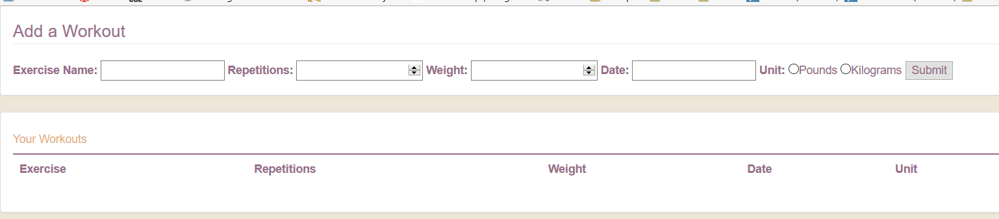

#Workout Tracker

##About
A Node App featuring a workout tracker that supports persistent entries and all CRUD operations

##Installation
Clone the directory and run `npm install` to get dependencies.

##Run App
To build the app run `node server` at the command line.

##View Web App
To view the web app direct your browser to 'http://localhost:3001/reset-table'

##Screenshots
<table>
    <tr>
        <td>
            
        </td>
    </tr>
</table>

##License
All rights reserved.

     
     
